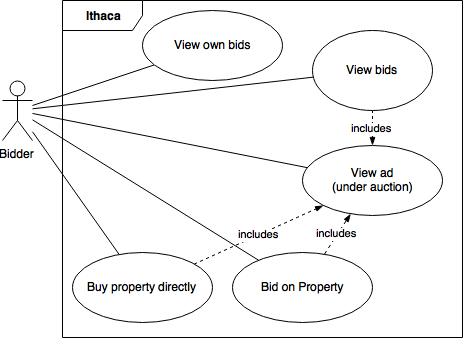

# Software requirements specification

## Introduction

### Purpose

This document gives a detailed description of the requirements for the web application project **Ithaca**.

All functional and non-functional requirements are listed and documented in this document. The document also gives a brief overview of the overall application and collaborating external systems.

This document serves as basis for discussions with the customer during the initial phase of the project.

Furthermore the document serves as contract between the customer and the developer team, on which both can depend during the whole project.

The document is continuously updated during the whole project. Old versions of the document can be retrieved anytime from the version control system.

### System overview

The web application **Ithaca** is a web portal for real estate, where users can place ads for real estate. The goal of the customer is to build a web portal which provides the users with effective support doing real estate related tasks like managing enquiries, organizing on-site visits and so on.

The system being built is based on an already existing application which should be generally revised and extended with additional functionality.

### Stakeholders

Multiple stakeholders play various roles in the project:

- the **customer**: defines the requirements the system has to fulfill
- the **users**: will use the system
- the **developer team**: will collect the requirements and build the system according to the requirements

### Definitions

The following sections describe abbreviations and special terms used in this document.

#### Domain specific terms

|Term|Description|
|---|---|
|Ithaca|The web-application for managing ads for real estate|
|Ad|An advertisement for real estate|
|Enquiry|A request of a person to visit real state|
|Real estate manager|The person which manages real estate (places ads, organizes visits)|

#### Technical terms

|Term|Description|
|---|---|
|DB|Database|
|Java|Programming language used for the project|
|Spring|Spring Framework, a Java framework|
|HTML|Hypertext Markup Language|
|JS|JavaScript, scripting language|
|CSS|Cascading Stylesheets|
|MVC|Model View Controller, a software architecture used in the system|
|Git|A software version control system|

### References

#### Domain specific

- Customer requirements document [https://github.com/scg-unibe-ch/ese2016/wiki/Project-Description](https://github.com/scg-unibe-ch/ese2016/wiki/Project-Description)

#### Technical

- Spring Framework: [https://spring.io](https://spring.io)
- Spring Data: [http://projects.spring.io/spring-data/](http://projects.spring.io/spring-data/)
- Spring MVC: [http://projects.spring.io/spring-framework/](http://projects.spring.io/spring-framework/)
- Spring Security: [http://projects.spring.io/spring-security/](http://projects.spring.io/spring-security/)
- MySQL: [http://www.mysql.com](http://www.mysql.com)

## Overall description

### Use cases

#### Use case index

| Use Case ID | Use Case Name | Primary Actor | Complexity | Priority |
|----------|:-------------:|------:|------:|------:|
|uc01|Sign up|User visiting the web portal |Med|1|
|uc02|Log in|The user of the web application |Low|1|
|uc03|Edit public profile|The user of the web application|Med|2|
|uc04|Logout|The user of the web application|Low|2|
|uc05|Search ad|The user of the web application|High|1|
|uc06|Sort search result|The user of the web application|Med|2| 
|uc07|Filter search results|The user of the web application|Med|2| 
|uc08|View ad|The user of the web application|Med|1| 
|uc09|Bookmark ad|The user of the web application|Med|2| 
|uc10|Delete bookmark|The user of the web application|Low|2| 
|uc11|View advertiser profile|The user of the web application|Med|2| 
|uc12|Send message to advertiser|The user of the web application|Med|1| 
|uc13|Send enquiry to advertiser|The user of the web application|Med|1| 
|uc14|View ad location|The user of the web application|Med|2| 
|uc15|Create Ad|The user of the web application|High|1| 
|uc16|Create and send Message|The user of the web application|Med|1| 
|uc17|View sent messages|The user of the web application|Low|2| 
|uc18|View incoming messages|The user of the web application|Med|2| 
|uc19|Send enquiry|The user of the web application|High|1| 
|uc20|View enquiries|The real estate manager|Med|1| 
|uc21|Accept enquiry|The real estate manager|Med|2| 
|uc22|Decline enquiry|The real estate manager|Med|2| 
|uc23|View Schedule|The user of the web application|Med|2| 
|uc24|See list of visitors|The real estate manager|Med|2| 
|uc25|Visit Ad belonging to an enquiry|The user of the web application|Low|2| 
|uc26|View alerts|The user of the web application|Low|2| 
|uc27|Subscribe to alert|The user of the web application|Med|1| 
|uc28|Delete alert|The user of the web application|Low|2|
|uc29|Upgrade account|The user of the web application|Med|1|
|uc30|Bid on property|The user of the web application|Med|1|
|uc31|Buy property directly|The user of the web application|Med|1|
|uc32|View bids|The user of the web application|Low|1|
|uc33|View auctions|The manager of auctions|Med|1|
|uc34|View auction details|The manager of auctions|Med|1|
|uc35|Pause auction|The manager of auctions|Med|1|
|uc36|Resume auction|The manager of auctions|Med|1|
|uc37|Complete auction|The manager of auctions|Med|1|
|uc38|View extended alert criteria|The user of the web application|low|1|

#### User management

|Use case element|Description|
|:---|:---|
|**ID**|`uc01`|
|**Name**|Sign up|
|**Description**|The user creates an account on Ithaca.|
|**Primary actor**|User visiting the web portal|
|**Precondition**|The user visits the start page of the web portal. The user has no Ithaca account yet.|
|**Trigger**|A visitor wants to use the application|
|**Normal flow**|1. The user clicks on the button "login"|
||2. The login form and a link "sign up" is shown|
||3. The user clicks on the link "sign up"|
||4. The sign up form is shown|
||5. The user enter his name, his email address, a password and selects his gender. He selects the type of his account (normal or premium).|
||6. The user clicks on the button "Sign up"|
||7. The login page and a success message are shown|
|**Alternate flow**|If the user doesn't fill up the entire sign up form in step 5, validation error messages are shown.|
||If the user selects "premium" as account type in step 5, additional form elements for his credit card information and a choice of premium packages for fixed amounts of time are shown.|

|Use case element|Description|
|:---|:---|
|**ID**|`uc02`|
|**Name**|Login|
|**Description**|The user logs into the application|
|**Primary actor**|The user of the web application|
|**Precondition**|The user has signed up for an account (`uc01`) and visits the start page of the web portal.|
|**Trigger**|The user wants to use the application|
|**Normal flow**|1. The user clicks on the button "login"|
||2. The login form is shown|
||3. The user enters his email address and his password|
||4. The user clicks on the button "Login"|
||5. The user is logged in and the start page is shown|
|**Alternate flow**|If the user enters wrong credentials in step 3, an error message and the login form are shown.|

|Use case element|Description|
|:---|:---|
|**ID**|`uc03`|
|**Name**|Edit public profile|
|**Description**|The user edits his public profile, which is shown to other users.|
|**Primary actor**|The user of the web application|
|**Precondition**|The user is logged into the application. (`uc02`)|
|**Trigger**|The user wants to edit his public profile.|
|**Normal flow**|1. The user hovers over his user image in the header line of the web portal|
||2. The user clicks on the appearing button "Public profile"|
||3. His public profile information is shown|
||4. The user clicks on the button "Edit"|
||5. The form to edit his personal information like name, password and email is shown|
||6. The user changes some values|
||7. The user clicks on the button "Update"|
||8. The system shows a success message|
|**Alternate flow**|If the user enters invalid input, an error message is shown.|

|Use case element|Description|
|:---|:---|
|**ID**|`uc04`|
|**Name**|Logout|
|**Description**|The user logs out of the application|
|**Primary actor**|The user of the web application|
|**Precondition**|The user is logged into the the application. (`uc02`)|
|**Trigger**|The user wants to leave the application|
|**Normal flow**|1. The user hovers over his user image in the header line of the web portal|
||2. The user clicks on the appearing button "Logout"|
||3. The user is logged out and the start page of the web portal is shown|
|**Alternate flow**|None|

|Use case element|Description|
|:---|:---|
|**ID**|`uc29`|
|**Name**|Upgrade user account|
|**Description**|The user upgrades his account from normal to premium|
|**Primary actor**|The user of the web application|
|**Precondition**|The user is logged into the the application (`uc02`) and visits his profile page (`uc03`).|
|**Trigger**|The user wants to upgrade his account to get more benefit of the application|
|**Normal flow**|1. The user clicks on the button "Upgrade account"|
||2. A form to get the credit card information of the user is shown. The user has to choose between different packages of a certain amount of time of premium subscription|
||3. The user fills out the form and clicks on "Save"|
||4. The account is upgraded to premium|
|**Alternate flow**|If a user enters an invalid value, an error message is shown.|

#### Searching and viewing ads

|Use case element|Description|
|:---|:---|
|**ID**|`uc05`|
|**Name**|Search ad|
|**Description**|The user searches some ads which meet search criteria defined by the user.|
|**Primary actor**|The user of the web application|
|**Precondition**|The user visits the web portal.|
|**Trigger**|The user wants to find specific ads|
|**Normal flow**|1. The user clicks on the button "Find ad" in the menu bar|
||2. The search form is shown|
||3. The user enters his search criteria|
||4. The user clicks on the button "Search"|
||5. The system shows a list with all ads which meet the search criteria and a form with the entered search criteria|
|**Alternate flow**|If the user doesn't enter some required search criteria, validation error messages are shown.|
||If no results are found, an appropriate message is shown.|

|Use case element|Description|
|:---|:---|
|**ID**|`uc06`|
|**Name**|Sort search result|
|**Description**|The user sorts the displayed search results|
|**Primary actor**|The user of the web application|
|**Precondition**|The user performed a search and got some results (`uc05`)|
|**Trigger**|The user wants to sort the search result according to some criteria|
|**Normal flow**|1. The user selects the sort criteria|
||2. The user clicks on the button "Sort"|
||3. The results are shown in order according to the selected criteria|
|**Alternate flow**|None|

|Use case element|Description|
|:---|:---|
|**ID**|`uc07`|
|**Name**|Filter search results|
|**Description**|The user filters the displayed search results according to some extended criteria.|
|**Primary actor**|The user of the web application|
|**Precondition**|The user performed a search and got some results (`uc05`)|
|**Trigger**|The user wants to filter the search results|
|**Normal flow**|1. The user enters his search/filter criteria into the search/filter form|
||2. The user clicks on the button "Filter"|
||3. The system shows the filtered result and the selected filter criteria|
|**Alternate flow**|If the user cancels the filtering in step 2, the filter form is reset to the original values before the user changed anything.|

|Use case element|Description|
|:---|:---|
|**ID**|`uc08`|
|**Name**|View ad|
|**Description**|The user reads the detailed information (attributes, images, description and others) of an advertisement.|
|**Primary actor**|The user of the web application|
|**Precondition**|The user visits either the start page of the web portal or performed a successful search (`uc05`).|
|**Trigger**|The user wants to see the details of an ad|
|**Normal flow**|1. The user clicks on the ad|
||2. The system shows detailed information about the ad|
|**Alternate flow**|None|

|Use case element|Description|
|:---|:---|
|**ID**|`uc09`|
|**Name**|Bookmark ad|
|**Description**|The user can bookmark an ad so that can easily find it again.|
|**Primary actor**|The user of the application|
|**Precondition**|The user is logged in `uc02` and views a specific ad `uc08` of which he's not the creator|
|**Trigger**|The user likes some ad and wants to easily find it again later|
|**Normal flow**|1. The user clicks on the button "Bookmark"|
||2. The systems saves the bookmark and marks the ad as bookmarked|
|**Alternate flow**|None|

|Use case element|Description|
|:---|:---|
|**ID**|`uc10`|
|**Name**|Delete bookmark|
|**Description**|The user removes the bookmark from a previously bookmarked room.|
|**Primary actor**|The user of the web application|
|**Precondition**|The user is logged in `uc02` and views an add which he has previously bookmarked `uc09`.|
|**Trigger**|The user doesn't need a specific bookmark anymore|
|**Normal flow**|1. The user clicks on the button "Bookmarked"|
||2. The system deletes the bookmark and removes the bookmark from the ad|
|**Alternate flow**|None|

|Use case element|Description|
|:---|:---|
|**ID**|`uc11`|
|**Name**|View advertiser profile|
|**Description**|The user views information about the advertiser of a specific ad|
|**Primary actor**|The user of the web application|
|**Precondition**|The user views a specific ad `uc08`|
|**Trigger**|The user wants to see information about the advertiser|
|**Normal flow**|1. In the information panel about the advertiser, the user clicks on the button "Visit profile"|
||2. The system shows all information about the advertiser|
|**Alternate flow**|None|

|Use case element|Description|
|:---|:---|
|**ID**|`uc12`|
|**Name**|Send message to advertiser|
|**Description**|The user contacts the advertiser by sending him a message|
|**Primary actor**|The user of the web application|
|**Precondition**|The user is logged in `uc02` and views a specific ad `uc08` or visits the advertiser profile `uc11`|
|**Trigger**|The user wants to contact the advertiser of a specific ad|
|**Normal flow**|1. The user clicks on the button "Contact advertiser" (on ad details page) or "Message" (on advertiser profile page)|
||2. The system shows a popup with a form for sending a message|
||3. The user enters a subject and the message|
||4. The user clicks on the button "Send"|
||5. The message is sent to the advertiser|
|**Alternate flow**|If the user doesn't fill up the form correctly in step 3, the message is not sent.|
||If the user cancels the process, the popup is hidden and no message is sent.|

|Use case element|Description|
|:---|:---|
|**ID**|`uc13`|
|**Name**|Send enquiry to advertiser|
|**Description**|The user send a visiting request to the advertiser|
|**Primary actor**|The user of the web application|
|**Precondition**|The user is logged in `uc02` and views a specific ad `uc08`|
|**Trigger**|The user wants to visit a specific property|
|**Normal flow**|1. The user chooses the visiting time from the list of the available visiting times|
||2. The user clicks on the button "Send enquiry to advertiser" next to the desired visiting time|
||3. The system saves the enquiry and sends it to the advertiser|
|**Alternate flow**|None|

|Use case element|Description|
|:---|:---|
|**ID**|`uc14`|
|**Name**|View ad location|
|**Description**|The user can see the location of the property on a map|
|**Primary actor**|The user of the web application|
|**Precondition**|The user views a specific ad `uc08`|
|**Trigger**|The user wants to see the location of a specific property|
|**Normal flow**|1. The user clicks on the address of the property|
||2. The browser opens the GoogleMaps web page and displays the location of the property on the map|
|**Alternate flow**|None|

#### Creating an ad

|Use case element|Description|
|:---|:---|
|**ID**|`uc15`|
|**Name**|Create Ad|
|**Description**|The user creates an Ad|
|**Primary actor**|The user of the web application|
|**Precondition**|The user is logged into the the application.|
|**Trigger**|The user wants to create an Ad|
|**Normal flow**|1. The user clicks the button "place ad" in the header of the application|
||2. The form "Place an ad" is shown. Optional Fields are labelled with (optional)|
||3. The user specifies the Ad Title, the Type of Property; Address; Move-in-Date; Size and number of rooms; floor level; distance to school, shopping and public transport; year of construction and renovation.|
||4. The user adds property descriptions to the Ad. Descriptions are added when the user clicks on checkboxes. In addition, the user adds a description as free text.|
||5. The user chooses whether or not the property will be sold in an auction and specifies auction related fields such as starting price, amount of increase, immediate buying price and start and end dates of the auction.|
||6. The user uploads pictures|
||7. The user specifies preferred Visiting times|
||8. The user clicks on "Submit" in order to create the Ad|
|**Alternate flow**|If a mandatory field is not filled out, an error message pops up which advises the user to add the missing field.|

#### Messaging

|Use case element|Description|
|:---|:---|
|**ID**|`uc16`|
|**Name**|Create and send Message |
|**Description**|The user sends a message to another user.|
|**Primary actor**|The user of the web application|
|**Precondition**|The user is logged into the application.|
|**Trigger**|The user wants to send a message to another user.|
|**Normal flow**|1. The user hovers over his user image in the header line of the web portal|
||2. The user clicks on the appearing button "Messages"|
||3. The user's inbox is shown|
||4. The user clicks on the button "New"|
||5. The user enters the address of the receiver, the message's subject and the message text|
||6. The user clicks the button "send"|
|**Alternate flow**| If the receiver is not valid, a dialog with the message "User does not exist." appears|

|Use case element|Description|
|:---|:---|
|**ID**|`uc17`|
|**Name**|View sent messages |
|**Description**|The user views the messages he sent previously.|
|**Primary actor**|The user of the web application|
|**Precondition**|The user is logged into the application. The user has sent a message before.|
|**Trigger**|The user wants to check his sent messages.|
|**Normal flow**|1. The user hovers over his user image in the header line of the web portal|
||2. The user clicks on the appearing button "Messages"|
||3. The user's inbox is shown|
||4. The user clicks on "Sent" in the box on the left.|
||5. The sent messages are displayed. The user clicks on a sent message to view its text.|
|**Alternate flow**|None| 

|Use case element|Description|
|:---|:---|
|**ID**|`uc18`|
|**Name**|View incoming messages |
|**Description**|The user views the messages he received previously.|
|**Primary actor**|The user of the web application|
|**Precondition**|The user is logged into the application. The user has received a message|
|**Trigger**|The user wants to check the messages he received.|
|**Normal flow**|1. The user hovers over his user image in the header line of the web portal|
||2. The user clicks on the appearing button "Messages"|
||3. The user's inbox is shown with all the received messages.|
||4. The user clicks on a message to view its text.
|**Alternate flow**|None|

#### Enquiries

|Use case element|Description|
|:---|:---|
|**ID**|`uc19`|
|**Name**|Send enquiry|
|**Description**|A user, which wants to visit a flat sends an enquiry to the Real estate manager.
|**Primary actor**|The user of the web application|
|**Precondition**|The user is logged into the application.|
|**Trigger**|The user wants visit a property he is interested in.|
|**Normal flow**|1. The user clicks on an Ad he is interested in.|
||2. Under "Visiting times", the possible times of a visit are listed.|
||3. The user can click on the button "Send enquiry to advertiser" to send an enquiry.|
|**Alternate flow**|None|

|Use case element|Description|
|:---|:---|
|**ID**|`uc20`|
|**Name**|View enquiries|
|**Description**|The Real estate manager views his enquiries.|
|**Primary actor**|The Real estate manager|
|**Precondition**|The Real estate manager is logged into the application.|
|**Trigger**|The Real estate manager wants to view the enquiries he received.|
|**Normal flow**|1. The Real estate manager hovers over his user image in the header line of the web portal.|
||2. He clicks on the appearing button "Enquiries"|
||3. A list with all enquiries appears, which were sent by other users. Accepted and declined enquiries are listed, as well as enquiries for which a decision has to be made|
|**Alternate flow**|None|

|Use case element|Description|
|:---|:---|
|**ID**|`uc21`|
|**Name**|Accept enquiry|
|**Description**|The Real estate manager accepts an enquiry, which he received from another user which is interested in the manager's flat.|
|**Primary actor**|The Real estate manager|
|**Precondition**|The Real estate manager is logged into the application.|
|**Trigger**|The Real estate manager wants to accept an enquiry.|
|**Normal flow**|1. The Real estate manager hovers over his user image in the header line of the web portal.|
||2. He clicks on the appearing button "Enquiries"|
||3. A list with all enquiries appears.|
||4. The manager accepts an enquiry by clicking the button "Accept".|
|**Alternate flow**|None|

|Use case element|Description|
|:---|:---|
|**ID**|`uc22`|
|**Name**|Decline enquiry|
|**Description**|The Real estate manager declines an enquiry, which he received from another user which is interested in the managers flat.|
|**Primary actor**|The Real estate manager|
|**Precondition**|The Real estate manager is logged into the application.|
|**Trigger**|The Real estate manager wants to decline an enquiry.|
|**Normal flow**|1. The Real estate manager hovers over his user image in the header line of the web portal.|
||2. He clicks on the appearing button "Enquiries"|
||3. A list with all enquiries appears.|
||4. The manager declines an enquiry by clicking the button "Decline".|
|**Alternate flow**|None|

#### Schedule

|Use case element|Description|
|:---|:---|
|**ID**|`uc23`|
|**Name**|View Schedule|
|**Description**|The user watches his schedule.|
|**Primary actor**|The user of the web application|
|**Precondition**|The user is logged into the application.|
|**Trigger**|The wants to view the Schedule of his enquiries.|
|**Normal flow**|1. The user estate manager hovers over his user image in the header line of the web portal.|
||2. He clicks on the appearing button "Schedule"|
||3. A list with all the visits the user has planed appears. The location to visit as well as time and date is displayed. In addition, if the user accepted enquiries for his own Ad, it is displayed when other users visit his estate.|
|**Alternate flow**|None|

|Use case element|Description|
|:---|:---|
|**ID**|`uc24`|
|**Name**|See list of visitors|
|**Description**|The Real estate manager checks when visitors visits his flat.|
|**Primary actor**|The Real estate manager.|
|**Precondition**|The Real estate manager is logged into the application and created an Ad. He is in the Schedule view (`uc23`).|
|**Trigger**|The Real estate manager wants to see which users are going to visit his real estate at a specific enquiry.
|**Normal flow**|1. The Real estate manager clicks on the button "See visitors" next to a enquiry.|
||2. A list with all visitors which are visiting at a given time is shown. For each visitor, a rating is displayed.
|**Alternate flow**|None|

|Use case element|Description|
|:---|:---|
|**ID**|`uc25`|
|**Name**|Visit Ad belonging to an enquiry|
|**Description**|The user visits an Ad which belongs to an equiry which is listed in his schedule.|
|**Primary actor**|The user of the web application|
|**Precondition**|The user is logged into the application. He is in the Schedule view (`uc23`). He has at least on enquiry in his schedule.|
|**Trigger**|The user wants to see which Ad is connected with his enquiry.
|**Normal flow**|1. The Real estate manager clicks on the button "Visit" next to a enquiry.|
||2. The user is redirected to the Ad.
|**Alternate flow**|None|

#### Alerts

|Use case element|Description|
|:---|:---|
|**ID**|`uc26`|
|**Name**|View alerts|
|**Description**|The user views his alerts.|
|**Primary actor**|The user of the web application|
|**Precondition**|The user is logged into the application.|
|**Trigger**|The user wants to check his alerts.|
|**Normal flow**|1. The user hovers over his user image in the header line of the web portal.|
||2. He clicks on the appearing button "Alerts"|
||3. A list with all alerts is displayed.|
|**Alternate flow**|None|

|Use case element|Description|
|:---|:---|
|**ID**|`uc27`|
|**Name**|Subscribe to alert|
|**Description**|The user subscribes to an alert.|
|**Primary actor**|The user of the web application|
|**Precondition**|The user is logged into the application. The user is in the Alerts view (`uc25`).|
|**Trigger**|The user want to subscribe to an alert.|
|**Normal flow**|1. The user fills out a form, in which he specifies under which conditions a newly created Ad creates an alert. The following criteria are specified by the user: Types of accomodation (Apartment, Loft, House, Villa, Studio), Max Price, City/zip code, radius (maximal accepted distance from specified city), and if the alert should be triggered by ad, which are for buying or for renting.
||2. The user subscribes to the alert by clicking the "Subscribe" button.| 
|**Alternate flow**|The user clicks the checkbox "Extended Alert". He then specifies additional criteria, based on which the alert triggers (additional criteria: ).|

|Use case element|Description|
|:---|:---|
|**ID**|`uc28`|
|**Name**|Delete alert|
|**Description**|The user deletes an existing alert.|
|**Primary actor**|The user of the web application|
|**Precondition**|The user is logged into the application. The user is in the Alerts view (`uc25`). The user has created an alert.|
|**Trigger**|The user wants to delete an alert.|
|**Normal flow**|1. The user views the active alerts in the Alerts view.|
||2. The user deletes the alert by clicking the "Delete" button.| 
|**Alternate flow**|None|

|Use case element|Description|
|:---|:---|
|**ID**|`uc38`|
|**Name**|View extended alert criteria|
|**Description**|The user checks the alert criteria of an extended alert he created.|
|**Primary actor**|The user of the web application|
|**Precondition**|The user is logged into the application. The user is in the Alerts view (`uc25`). The user has created an extended alert.|
|**Trigger**|The user wants to see all the criteria he set when he created an alert.|
|**Normal flow**|1. The user views the active alerts in the Alerts view.|
||2. The user clicks on the "details" button right of the extended alert. A modal apprears, which shows all the extended alert criteria| 
|**Alternate flow**|None|

#### Auctions

##### Bidding and purchase requests

|Use case element|Description|
|:---|:---|
|**ID**|`uc30`|
|**Name**|Bid on Property|
|**Description**|The user bids the next bigger value in an open auction.|
|**Primary actor**|The user of the web application|
|**Precondition**|The user is logged into the application. The user is viewing an ad of a property that is being sold through an auction (`uc08`).|
|**Trigger**|The user wants to buy a property through auction.|
|**Normal flow**|1. The user views the description of the ad and sees how much has been bid for the property and how much increase he has to bid in order to partake in the auction.|
||2. The user pushes the "Bid" button.| 
||3. A confirmation dialog is shown.|
||4. The user clicks the button "Bid" to complete the bid.|
||5. A confirmation message is shown that the bid was successful.|
|**Alternate flow**|If the auction ends during the time the user is viewing the ad and tries to bid, an error message is shown, that the auction has already ended.|

|Use case element|Description|
|:---|:---|
|**ID**|`uc31`|
|**Name**|Buy Property directly|
|**Description**|The user makes a purchase request to buy a property in an open auction directly for a fixed price.|
|**Primary actor**|The user of the web application|
|**Precondition**|The user is logged into the application. The user is viewing an ad of a property that is being sold through an auction (`uc08`).|
|**Trigger**|The user wants to buy a property directly and not bid in the auction.|
|**Normal flow**|1. The user views the description of the ad and checks what the fix buying price for the property is.|
||2. The user pushes the "Buy" button.|
||3. A confirmation dialog is shown.|
||4. The user clicks the button "Buy" to complete the purchase request.|
||5. The purchaser request is registered and a confirmation message is shown that the request was submitted successfuly.|
|**Alternate flow**|If the auction ends during the time the user is viewing the ad and tries to bid, an error message is shown, that the auction has already ended.|

|Use case element|Description|
|:---|:---|
|**ID**|`uc32`|
|**Name**|View bids|
|**Description**|The user checks the bids which have already been registered for an ad under auction.|
|**Primary actor**|The user of the web application|
|**Precondition**|The user is logged into the application. The user is viewing an ad of a property that is being sold through an auction (`uc08`).|
|**Trigger**|The user wants to buy a property directly and not bid in the auction.|
|**Normal flow**|1. The user clicks on the button "Show bids"|
||2. A popup containing a list of the 10 most recent bids is shown.|
|**Alternate flow**|None|

|Use case element|Description|
|:---|:---|
|**ID**|`uc38`|
|**Name**|View own bids|
|**Description**|The user gets an overview over all the auctions in which he participated.|
|**Primary actor**|The user of the web application|
|**Precondition**|The user is logged into the application and participated in at least one auction.|
|**Trigger**|The user wants to see his own bids.|
|**Normal flow**|1. The user clicks on the menu point "My bids"|
||2. A page containing a list of all his auctions and his bids shows up.|
|**Alternate flow**|None|

##### Auction management

|Use case element|Description|
|:---|:---|
|**ID**|`uc33`|
|**Name**|View auctions|
|**Description**|The user checks his auctions.|
|**Primary actor**|The manager of auctions|
|**Precondition**|The user is logged into the application and has placed some ads under auction.|
|**Trigger**|The user wants to check the state of his auctions.|
|**Normal flow**|1. The user clicks on the button "Manage Auctions" in the main user menu|
||2. A page containing a list of all his auctions, grouped by auction state, is shown.|
|**Alternate flow**|None|

|Use case element|Description|
|:---|:---|
|**ID**|`uc34`|
|**Name**|View auction details|
|**Description**|The user checks the state of one specific auction.|
|**Primary actor**|The manager of auctions|
|**Precondition**|The user is logged into the application and has placed some ads under auction. The user is on the auction management page (`uc33`)|
|**Trigger**|The user wants to check the state of a specific auction.|
|**Normal flow**|1. The user clicks on the link "Auction details" near one of the listed auctions|
||2. A page containing information about this auction (start date, end date, price, increment, registered bids and purchase requests) is shown.|
|**Alternate flow**|None|

|Use case element|Description|
|:---|:---|
|**ID**|`uc35`|
|**Name**|Pause auction|
|**Description**|The user pauses a running auction.|
|**Primary actor**|The manager of auctions|
|**Precondition**|The user is logged into the application and has placed some ads under auction. The user is on the details page of a running auction (`uc34`)|
|**Trigger**|The user wants to pause an auction (e.g. for checking a purchase request).|
|**Normal flow**|1. The user clicks on the button "Pause auction"|
||2. A success message is shown and the auction is paused.|
|**Alternate flow**|None|

|Use case element|Description|
|:---|:---|
|**ID**|`uc36`|
|**Name**|Resume auction|
|**Description**|The user resumes a running auction.|
|**Primary actor**|The manager of auctions|
|**Precondition**|The user is logged into the application and has placed some ads under auction. The user is on the details page of a paused auction (`uc35`)|
|**Trigger**|The user wants to resume a paused auction.|
|**Normal flow**|1. The user clicks on the button "Resume auction"|
||2. A success message is shown and the auction is running again.|
|**Alternate flow**|None|

|Use case element|Description|
|:---|:---|
|**ID**|`uc37`|
|**Name**|Complete auction|
|**Description**|The user completes a running, paused or expired auction.|
|**Primary actor**|The manager of auctions|
|**Precondition**|The user is logged into the application and has placed some ads under auction. The user is on the details page of a running, paused or expired auction (`uc34`)|
|**Trigger**|The user wants to complete an auction.|
|**Normal flow**|1. The user clicks on the button "Complete auction"|
||2. A success message is shown an the auction is completed.|
|**Alternate flow**|None|

### Actor characteristics
In general, the users of the Ithaca are expected to have little or no technical experience. However, they are expected to have some base knowledge of the general use of message services and internet applications.

The users of the FlatFindr can be divided in two main categories: 

1. The users, which search a real estate (=suitors).
2. The users, which have a real estate to rent or sell (real estate managers).

#### Suitors
Suitors are people who want to rent or buy a real estate. As Ithaca is a platform which promotes ads for different types of homes, both for renting and buying, the suitors can be people of all ages in different situations in life.

**Expectations of at the application**
Suitors expect, that the application

1. offers a good and easy search service 
2. has a message service
3. can contact them, when an ad of interest is created
4. allows an easy way to schedule visit times with the real estate managers
5. has a schedule function, which gives the suitors an overview over his planned visits

**User interactions**
The suitors 

1. searches ads 
2. creates alerts
3. writes and receives messages 
4. sends enquiries to real estate managers
5. edits his public profile
6. checks his schedule to get an overview over his enquiries
7. participates in auctions
8. pays to upgrade his account to premium

#### Real estate manager
Real estate managers have a real estate to rent or sell.

**Expectations of at the application**
Real estate managers expect, that the application

1. offers an easy way to create ads
2. has a message service
3. allows management of multiple ads 
4. offers an easy way to schedule visit times with suitors.
5. has a schedule function, which gives the real estate managers an overview over the visit times of suitors.
6. has a working auction functionality for sale of property

**User interactions**
The real estate manager

1. creates ads
2. writes and receives messages 
3. Accepts or declines enquiries from suitors
4. edits his public profile
5. checks his schedule to get an overview over his enquiries and the visiting suitors
6. edits his public profile
7. pays to upgrade his account to premium
8. controls direct buying price and bid increase in auctions

## Requirements

### Functional requirements

#### User management

##### Login

The user can login to the application. Therefore he has to enter his email-address and his password into the login-form. If he has no account yet, he can sign up as a new user.

##### Signup

For signing up as a new user he has to enter his first and last name, select his gender and give his email-address and a password, which has to be at least 6 characters long.

The user can choose the account type. There are two account types (premium and normal) If the user chooses premium, he has to enter his credit card information and duration of premium membership during signup. 

If any of these informations aren't filled in, an error occurs, which tells the user that he must fill in a valid information.

The user can also sign up with his google account. For this, a pop-up window appears in which the user confirms the signup and types in his google password. The login happens automatically after this signup, in contrast to the normal signup. After signing up like this, the user can log in using the google button, or change his password on edit profile and use this password and the Gmail address to log in normally.

##### Logged in users

A logged in user can:

- logout
- edit his public profile.There he can change his password, first name, last name, username and write something about himself. By clicking "update" his changes will be saved. 
- Normal users can upgrade their account to a premium account.

#### Messaging system

A logged in user can:

- **Send messages** in two ways:
 + sending messages by visiting the advertiser Profile and clicking on the button "Message".Then he can enter the subject and his message and click on "Send" if the want to send the message or click on "Cancel" to exit the message form. If no subject is filled in, the message won't be sent. If the subject is entered but no message, then the message wont'be sent. Only if both (subject and message) are entered, the message will be sent.
 + the other way of sending messages is by going into "Messages" from the dropdown menu and there click "New message". For the new message he has to specify to whom he wants to send the email and give in the subject and write his message. Then he can click either "send" (for sending the message) or "cancel" (for leaving the message form).If the user puts in a invalid email address of the recipient then there will appear a box saying: "This user does not exist". Again all information (to, subject, and message) have to be filled in, if not, the message won't be sent.

- **view his sent messages**: He can see in a chart the subject, sender, recipient and the date sent from each message he has ever sent. By clicking on a line from this chart he gets a view of the sent message.

- **view incoming messages**: He can see in a chart the subject, sender, recipient and the date sent from the each message he has received. By clicking on a line from this chart he gets a view of the message.

#### Searching and viewing ads

A user can search for ads by clicking the search button whether or not he's logged in. The initial search is filtered by zip code with max radius, max price and type (apartment, villa, house, studio or loft).

In the result lists, the ads of premium users are ranked higher than normal ads (see section "User roles" below).

After the results are displayed, the user can choose to:

- *Sort search:* The search results can be sorted by: ascending or descending price, move-in date earliest to latest or latest to earliest, or by the date the ad was created, youngest to oldest or oldest to youngest. 

- *Filter search:* The search can be filtered further by choosing upper and lower limits for number of rooms and square meters. These search criteria are always visible to the user. Additional filters can be shown by pressing a button. Here, the user can fill out the earliest and latest move-in date in a dropdown calendar. He can also check boxes for; balcony or patio, garage, parking, elevator and dishwasher. In a dropdown menu, the user can choose between the infrastructure types; satellite, cable or fiber optic cable. He can also choose upper and lower limits for; nr. of bathrooms, floor level, build year, renovation year, distance to school, shopping and public transport. These filters can be hidden again by pressing the above button a second time.

- *Participate in auction:* The user can participate in an auction when looking at ads for sale by directly buying or bidding from the result page.

- *View ad:* The user can click on an ad to view it. 

From the view of the ad, the user can:

- Bookmark ad or delete bookmark if the user is logged in.

- View the ad information. Description, address and the searchable criteria are all displayed. The visiting times and the information of the advertiser are shown.

- View the pictures of the property. They can be viewed one after the other by clicking a button to the right or to the left of the picture. 

- View advertiser profile, contact or send enquiry to advertiser if the user is logged in. If the user is not logged in, the boxes you can click to do these actions show "Login to send enquiries", "Login to visit profile" and "Login to contact advertiser" and will send you to the login screen.

- View ad location. The address in the information box on the top left is clickable and will redirect the user to google maps where the address is shown.

#### Alerts 

A logged in user can view and modify his alerts by choosing "Alerts" from the Profile drop-down menu. He can create a new alert by filling in the initial search criteria and clicking "Subscribe". In addition, the user can create an "Extended Alert". This way more criteria can be added, which determine when an alert triggers.

The following criteria can be added for an extended alert:

|Extended Alert Criteria||
|:---|:---|
|Infrastructure type|Earliest move-in date|
|Latest move-in date|Garage available|
|Balcony or Patio available|Parking available|
|Elevator available|Dishwasher available|
|Floor level |Build year|
|Nr. of Baths|Renovation year|
|Distance to school (m)|Distance to public transport (m)|
|Nr. of Rooms|Distance to shopping (m)|

For the number criteria, min and max can be specified. Under infrastructure type cable, satellite and fiber optic cable can be selected.

Below where the user can create new alerts is "Your active alerts", where he can view a list of alerts in a table with type, city, radius, max price and a column "Action" with a button to delete the alert. If the alert is an extended alert, a button "Details" appears under the column "Action". With this button, the user can view the criteria, which he specified by creating an extended alert.

If an alert is triggered, the user gets a message to his inbox in the application. The message is also sent to his email account.

The application distinguishes between normal and premium users (see section 'User roles' below).

#### Placement of advertisements

A real estate manager can create a new advertisement for real estate. An advertisement consists of required general information and additonal optional information about the real estate it concerns.

The advertiser can specify, whether he wants to sell or rent a real estate by choosing the appropriate tab "buy" or "rent" before placing the ad.

The following general information can be declared:

- The *title* of the advertisement (text)
- The *type* of the real estate (appartment, house, villa, loft, studio)
- The *location* of the real estate (*street* and *zip code*)
- The *move-in date*
- The *size* of the real estate in square meters
- The *number of rooms*
- The *floor level*
- The *distance to school/shopping center/public transport* from dropdown menu (100m intervals)
- The *construction / renovation date*
- The *price* (per month for renting or total price for buying)

In the case of selling property, it can be done by *auction*. A checkbox can be checked and additional information entered:

- *Immediate buy price for auction*
- *Startdate for auction*
- *Enddate for auction* from dropdown calendar
- *Startprice for auction*
- *Amount of increase of bid price*

The following information can be specified with a number or with a selection of options:

- number of *bath rooms*
- type of *infrastructure* for TV/internet (satellite, fiber, cable etc.)

The following *additional attributes* of the real estate can be specified in a yes/no manner:

- a *balcony* belongs to the real estate
- a *garage* or *parking space* belongs to the real estate
- *elevator* available
- *dishwasher* available (only for rent)

Additionally a *textual description* of the real estate can be added to the ad.

*Images* of the real estate can be added to the advertisement to give users a better impression of the real estate. This is not mandatory.

The advertiser can specify multiple possible *visiting times* for enquiries. A visiting time is specified by a date, a start time and an end time. This is not mandatory.

#### Auctions

When an ad is up for sale and the owner has chosen the *auction* option, users can bid on the property. There is also a "buy directly" price. Both startprice for bidding and bidding increment is specified by the property owner, as is the direct buy price. The auction has an end date when it is no longer possible to bid.

Users can either bid for an auction or make a purchase request to buy the property directly. Users can bid multiple times for the same ad. But they can only make one purchase request per ad.

Users can see the last few bids for an ad. This gives them a hint to the strategy of other bidders.

A user can get an overview over all the auctions, in which he participated.

Advertisers can manage their properties which are put under auction. Auctions can be in different states:

- **Not yet started**: The start date of the auction lies in the future. Users can't bid for it until now.
- **Running**: Users can bid for this auction or place a purchase request. The manager can look at the bids and purchase requests which entered so far and may pause or even complete the auction before it expires.
- **Paused**: The auction is temporary suspended so no one can bid for it. The manager can resume or complete the auction.
- **Expired**: The end date of the auction is in the past. No one can bid for it anymore. The manager can contact the winner of the auction and complete it afterwards.
- **Completed**: The manager has contacted the winner of the auction and completed the auction.

The ads of auctions, which expired aren't shown in the search anymore.

#### User roles

As already mentioned, the application distinguishes two different user types: *premium* and *normal*.

The application behaves different for the different user roles as follows:

- If a new advertisement meets the filter criteria of an alert of a premium user, he immediately gets a message by the internal system mail box and by email.
- In the same situation, a normal user gets a summary of all triggered alerts once a day. The summary is sent to the internal system mail box and also by email.
- The advertisement of premium users are shown at the top of the search result list.

A normal user can upgrade to premium for a choice of durations with different prices. For this he has to give his credit card information. After the amount of days he has paid for has passed, the user is reverted back to normal status, the premium membership has run out. One day before the membership runs out, an email is sent to the user, informing about this. It is not possible to cancel the premium subscription since it is paid for in full.

#### Enquiries

A user can send an enquiry to a certain visiting time of a flat on that flat's advertisment page. All he needs to do is find the *Visiting Times* table on the flat's page and click the *Send enquiry to advertiser* button next to the date he'd like to visit the flat and his enquiry will show up on the owner of that flat's *Enquiry* page.

A logged in user can see his enquiries by choosing "Enquiries" from the Profile drop-down menu. There he sees a table of enquiries sent to him entailing the following: 

- *Sender*: The user name of the person who sent the enquiry,
- *Ad*: The address of the flat the enquiry has been sent for,
- *Date of the visit*: The date the sender has chosen to visit,
- *Date sent*: The date the enquiry has been sent to the user,
- *Actions*: Two buttons _decline_ and _accept_ where the user gives feedback to the sender on whether he accepts or declines the enquiry. After accepting or declining, the user can undo his choice by clicking the _undo_ button.

**NEW** A user can see the auction for a property he wants to sell with information about who bid and how much.

**NEW** A user who bid in an auction can see a list of all the properties he bid for and what their current state is.
	
#### Schedule 

A logged in user can see his personal schedule by choosing "Schedule" from the Profile drop-down menu. The schedule shows two tables, one named *Your presentations*, the other *Your visits*

_Your presentations_-table:
A table of the users owned properties, which he wants to rent to other people, containing the following:

- *Address*: The address of the property to be presented to interested people,
- *Date*: The date of the property presentation,
- *Time*: The time of the property presentation,
- *Visit Ad*: A button that if clicked will lead the user to the ad he posted about the flat in question
- *Visitors*: A button which will open a new site with some information about the property in question and a table of all people that will attend its presentation. The table contains the following: *Name* (full name of the user), *Username* (the Ithaca username of the user), *Profile* (a button that leads to the user's personal profile), *Rating* (the rating of one to 5 stars that this user has on the website)

_Your visits_-table:
A table of the properties a user is interested in and will or has already visited, containing the following:

- *Address*: The address of the flat, the user has visited,
- *Date*: The date of the presentation the user has attended,
- *Time*: The time of the presentation the user has attended,
- *Visit Ad*: A button that if clicked will guide the user to the advertisement of the property in question.

### Non-functional requirements

#### Design of the application

- The application design is built with bootstrap and can adapt to the size of any browser or device, such as tablet/notebook/smartphone
- The feel of the design is very modern, simple and user friendly