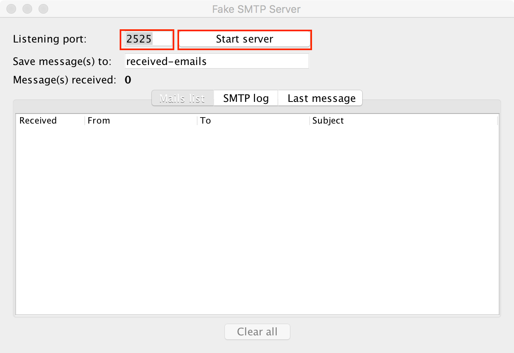

# FakeSMTP for Unit Tests

If mails should be sent during unit tests, a local smtp-server may be used. An example of such a server is [fakeSMTP](https://nilhcem.github.io/FakeSMTP/).

The application is checked into the git repository. So you don't need to download it yourself.

fakeSMTP has to be started and configured before execution of unit tests:

1. Start the application `/fakeSMTP/fakeSMTP-2.0.jar`
2. Set *Listening Port* to 2525 and click *Start server*

	

3. Sent messages are shown in the white area in the main application window and can be opened by double clicking.

# Important: Mail sending behaviour during tests

The Web-Application has to be configured to use the fake SMTP-server.

In the file `/project/src/main/webapp/WEB-INF/config/springMVC_test.xml` you can define whether the class `TestMailSender` or the class `MailSender` should be used for sending mails. The former doesn't send any mails, the later uses the local SMTP-server.

Just comment the bean configuration which shouldn't be used in the file `/project/src/main/webapp/WEB-INF/config/springMVC_test.xml`:

```xml
<!-- To not send mail at all, uncomment line 2 and comment line 5 -->
<bean id="mailSender" class="ch.unibe.ese.team3.util.TestMailSender" scope="singleton"></bean>

<!-- To send mail using local SMTP server uncomment line 5 and comment line 2-->
<bean id="mailSender" class="ch.unibe.ese.team3.util.MailSender" scope="singleton"></bean>
```